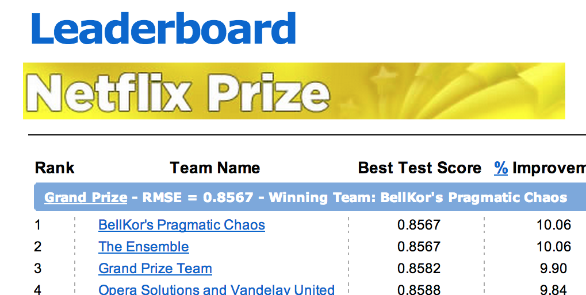

class: center, middle, inverse

# Learning, Optimization, and the Benefits of Noise

## Jacob Abernethy

### April 5, 2016

[jabernet@umich.edu](mailto:jabernet@umich.edu)

$\sum_{i=1}^0$

---
## Introduction

$k_d = \dfrac{\mathrm{Vector\,Sum\,of\,Voltages}}{\mathrm{Algebraic\,Sum\,of\,Voltages}}$

## Randomization Methods for Learning

## Duality of Optimization and Sampling

## Extracurriculurs
---

# What do I do?

* Machine Learning core
* Statistics
* Optimization + Convex Analysis
* Economics + Finance

???

Here are some slide notes

---
class: top

# Machine Learning $\approx$ Economics?

* What does 


--

--


--

--




---
## The Growth of ML Is Driven by Rising Economic Impact 

### We are seeing a growing number of industries disrupted by Learning and Predictive Technologies

* Online Advertising Markets (Circa 2007)
  * What about this
* Electronic (High Frequency) Trading (Circa 2008)
  * .paper[[Wellman, Abernethy, NSF SMALL, "Dynamics + Limits of Automated Trading"]]
* Automated Assistants e.g. Siri Circa 2010
  > Testing this

---
# Warmup: A Toy Prediction Problem

Learning with experts

---
# Four Different Algorithms

**A


---

```python
    def random_sample(self, x, y, theta, epsi=0.0001):
        val0, val1 = [np.exp(pt.dot(theta)) for pt in [x, y]]
        alpha = (np.log(0.5) + np.log(val1 / val0 + 1)) / np.log(val1 / val0)
        midpoint = x + alpha * (y - x)
        if epsi >= 1.0:
            return midpoint
        else:
            xnew, ynew = (x, midpoint) if cointoss() else (midpoint, y)
            return self.random_sample(xnew, ynew, theta, epsi=2 * epsi)

    def hit_and_run_fixed_temp(self, theta, numiter, initx=None, plot=False):
        x = self.x0 if (initx is None) else initx
        for itr in range(numiter):
            dirv = self.random_direction()
            bndry1, bndry2 = [self.find_bndry_pt(x, d) for d in [dirv, -dirv]]
            x = self.random_sample(bndry1, bndry2, theta)
        return x
```
