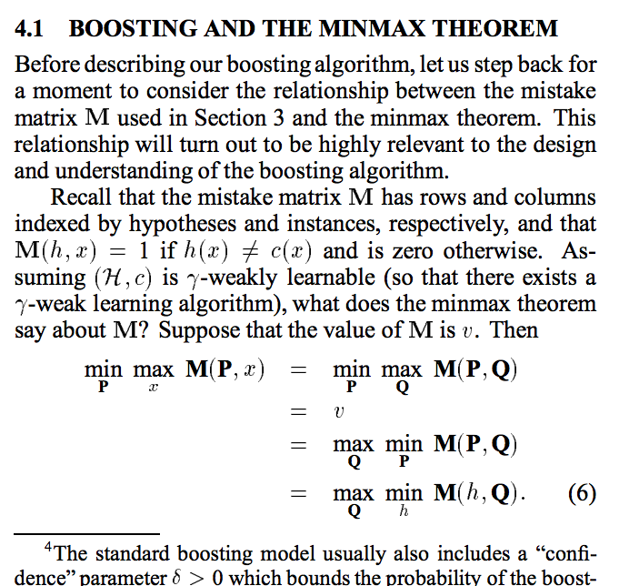
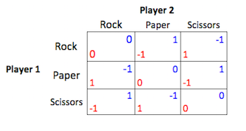
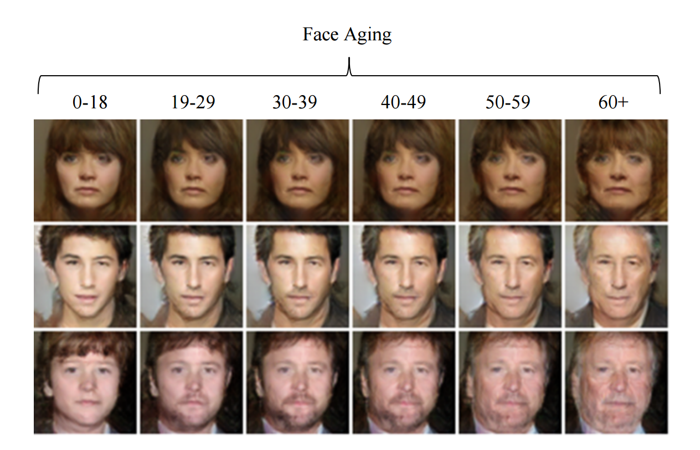

# Using Algorithms to Play Games and Vice Versa

### Jacob Abernethy
### September 29, 2017

$$
\def\DD{\mathbf{D}}
\def\EE{\mathop{\mathbb{E}}}
\def\argmin{\mathop{\arg\min}}
\def\argmax{\mathop{\arg\max}}
\def\K{\mathcal{K}}
\def\reals{\mathbb{R}}
\def\reg{\mathcal{R}}
\def\areg{\overline{\reg}}
$$

---

## Chess and AI

---

## A History of Computer Chess

---

## Modern Chess and Deep Learning

---

## Monte Carlo Tree Search

---

## AlphaGo

[Go, MTCS, Deep Learning](http://web.iitd.ac.in/~sumeet/Silver16.pdf)

---

## Algorithms make Algorithms Better

- Algorithms some times have bugs
- We miss cases, we don't consider unexpected inputs
- Modern tools help solve this problem:
    + IDEs that look for type issues
    + Unit testing

**Insight**: Maybe we can use learning to improve?

---

## Introduction to Boosting

- Assume we have some dataset $S = \\{(x_1, y_1), \ldots, (x_n,y_n)\\}$.
- Assume we have some set of *weak learners*, i.e. "stupid predictors", $\mathcal{H}$ a set of functions $\mathcal{X} \to \mathcal{Y}$.
    + **Weak Learning Condition**: For $\gamma > 0$, have $\forall D \in \Delta(S)\; \exists h \in \mathcal{H}: \quad \text{Pr}_{i \sim D}(h(x_i) = y_i) \geq 1 + \gamma$
- **Question**: Can we combine weak learners into a *strong* learner?
    + **Strong Learning Condition**: A weighted average over $h \in \mathcal{H}$ has 0 error.
- Freund/Schapire 1996ish: Yes!

---

## Basic Boosting Template

- Initialize weights $w_i = 1$ for every data point $(x_i, y_i)$.
- Initialize $H = \emptyset$, a "bag of predictors"
- For $t=1, \ldots, T$:
    + Define distribution $D$ via $D(i) = \frac{w_i}{\sum_j w_j}$
    + Query *weak learning oracle* to obtain $h$ so that $\text{Pr}_{i \sim D}(h(x_i) = y_i) \geq 1 + \gamma$
    + Insert $h$ into $H$
    + Update weights, $w_i \leftarrow w_i \beta^{\mathbb{1}[h(x_i) \ne y_i]}$
- Output *strong* predictor: $F_H(x) := \text{MajorityVote}(\\{h(x) : h \in H\\})$

---

## AdaBoost in Action

<!-- 
 -->

---

## Boosting via Game Playing?

---

## von Neumann's Minimax Theorem

*Intuition* When playing a two-player zero-sum game, if both players may choose a randomized strategy, then it really doesn't matter who commits to a strategy first.

**Theorem (von Neumann 1928)**: Let $M \in \mathbb{R}^{n \times m}$ be the payoff matrix for a zero-sum game. Then we have
$$\min_{p \in \Delta_n} \max_{q \in \Delta_m} p^\top M q = 
\max_{q \in \Delta_m} \min_{p \in \Delta_n}  p^\top M q $$

Note: $p^\top M q$ is the expected payoff when Player1, Player2 sample actions from $p$, $q$, respectively 

---

## Minimax Theorem ==> Boosting

- Given examples $S = (x_1, \ldots, x_n)$ and weak hypotheses $h_1(\cdot), \ldots, h_m(\cdot)$, define matrix $M$ via $$M[i,j] := 2\cdot\mathbf{1}[h_j(x_i) = y_i] - 1$$
- What are the semantics of "weak learning" and "strong learning"?
    + **Weak Learning Hypothesis** states that "on any distribution of data there's a weak hypothesis with better than random error rate".
        * WLH *equivalent to*: $\min_p \max_q p^\top M q \geq 2\gamma$
    + **Strong Learning Hypothesis** states that "there is some mixture of weak hypotheses such that a weighted majority vote of them always predicts correctly".
        * SLH *equivalent to*: $\max_q \min_p p^\top M q \geq 2\gamma$

---

## Detour: Classical Statistical Learning

Given unknown distribution on $z \sim D$. I want to "learn" some parameters $\theta \in \Theta$ to minimize a loss objective $\ell(\theta, z)$ (in expect.). I.e., want to find
$$ \theta^* := \arg\min_{\theta \in \Theta} \overbrace{\EE_{z \sim D} [ \ell(\theta, z)]}^{L(\theta)}$$
Unfortunately, all I have is a sample $z_1, \ldots, z_n$, so all I can do is choose $\hat \theta$ to minimize $\hat L(\theta) := \frac 1 n \sum_{i=1}^n \ell(\theta, z_i)$.

*Classical Statistical Learning*: under certain conditions we are guaranteed that $L(\hat \theta) \to L(\theta^*)$ at "a pretty fast rate".

---

## Alternative: Online Learning Framework

**Online convex optimization**:

- *learner* who chooses actions from compact/convex $K \subset \reals^n$
- For $t=1, \ldots, T$:
    + learner selects $x_t \in K$
    + learner receives convex loss function $\ell_t(\cdot)$ on $K$
    + learner pays $\ell_t(x_t)$
- Ultimately, learner wants to minimize *regret*
$$\areg_T := \frac 1 T \left( \sum_{t=1}^{T} \ell_{t}(x_{t}) - \min_{x \in K} \sum_{t=1}^T \ell_t(x) \right) $$
- **Goal: No Regret!** I.e., maybe it's possible to design alg. so that $\areg_T \to 0$?

---

## Minimax Thm via Online Learning (1)

**Beautiful Fact:** Existence of no-regret alg implies von Neumann Minimax!

- Let's prove a *harder* version of the minimax theorem.
- let $g(x,y)$ be convex in vector $x$ and concave in vector $y$
- **Von Neumann Generalized**: $\inf_x \sup_y g(x,y) = \sup_y \inf_x g(x,y)$
- *Note:* It's easy to show $\inf_x \sup_y g(x,y) \geq \sup_y \inf_x g(x,y)$. Proof strategy for harder $(\leq)$ direction:
    + Let both players choose $x_t$, $y_t$ in sequence
    + Players will update their actions by *learning* via Online Convex Opt.
    + The $x$-player's sequence of loss functions is $g(\cdot, y_1), g(\cdot,y_2), \ldots$
    + The $y$-player's sequence of loss functions is $-g(x_1, \cdot), -g(x_2,\cdot), \ldots$

---

## Minimax Thm via Online Learning (2)

Let's assume the $x$-player can drive her regret $\areg_T^x = o(1)$. Then
$$
\begin{eqnarray\*}
  \textstyle \frac 1 T \sum_{t=1}^T g(x_t, y_t) & = & \textstyle \frac 1 T \sum_{t=1}^T \ell_t(x_t) \\\\
  & = & \textstyle \min_{x} \left[ 
    \frac 1 T \sum_{t=1}^T \ell_t(x) \right] + \areg_T^x \\\\
  & =& \textstyle \min_{x} \left[ \frac 1 T \sum_{t=1}^T g(x, y_t) \right] + \areg_T^x \\\\
  & \leq & \min_{x}  
    g\left(x,{ \textstyle \frac 1 T \sum_{t=1}^T y_t}\right) + \areg_T^x \\\\
  & \leq & \max_{y} \min_{x}  g(x,y) + \areg_T^x
\end{eqnarray\*}
$$

---

## Minimax Thm via Online Learning (3)

We can apply same argument to $y$-player! Assume regret of $y$ is $\areg_T^y = o(1)$. Then
$$
\begin{eqnarray\*}
  \textstyle \frac 1 T \sum_{t=1}^T g(x_t, y_t) & \geq & 
    \textstyle \max_{y}  
    g\left({ \textstyle \frac 1 T \sum_{t=1}^T x_t}, y\right) - \areg_T^y \\\\
  & \geq  & \textstyle \min_{x} \max_{y}  g\left(x, y\right) - \areg_T^y
\end{eqnarray\*}
$$
Combining:
$$
    \min_{x} \max_{y}  g\left(x, y\right) - \areg_T^y \leq 
    \max_{y} \min_{x}  g(x,y) + \areg_T^x
$$
Recall: we can make $T \to \infty$ and send $\areg_T^x, \areg_T^y \to 0$

---

## This Proof Leads to an Algorithm

Let $\epsilon_T := \areg_T^x + \areg_T^y$. Let $V^*$ be OPT value of game. We showed:

$$
\begin{eqnarray*}
    \max_{y} g(
        \overbrace{ \textstyle \frac 1 T \sum_{t=1}^T x_t}^{\text{Avg. action } \bar{x}_T}
    , y) & \leq & V^* + \epsilon_T \\
    \min_{x}  g(x,
        \underbrace{\textstyle \frac 1 T \sum_{t=1}^T y_t}_{\text{Avg. action } \bar{y}_T}
    ) & \geq & V^* - \epsilon_T
\end{eqnarray*}
$$

- In other words, we extracted $\epsilon_T$-almost optimal solutions to the game
- How? Observe each alg's decisions, $x_1, x_2, \ldots$'s and $y_1, y_2, \ldots$'s, and *take the average*!

---

## What's the Best OCO Algorithm?

Different settings ==> Different algorithms
1. When $x \in \Delta_n$, $\ell_t(x) = l_t^\top x$ (linear loss), $\\|l_t\\|_\infty \leq 1$, then:
    - **Exponential Weights Algorithm**: $x_{t+1}[i] =  \frac{x_t[i]\exp(-\eta l_t[i])}{Z_t}$
    - Can guarantee: $\areg_T = O\left( \sqrt{\frac{\log n}{T}} \right)$
1. When $x \in L_2\text{-ball}$, $\ell_t(x)$ convex and $C$-lipschitz, then:
    - **Gradient Descent Algorithm**: $x_{t+1} = x_t - \eta \nabla \ell_t(x_t)$
    - Can guarantee: $\areg_T = O\left( \sqrt{\frac{C^2 \\|x^*\\|^2}{T}} \right)$
    - Logistical problem: update $x_t - \eta \nabla \ell_t(x_t)$ may violate constraints! Need to do projection :-(

---

## Key Facts of Online Learning

- OCO algorithms must manage tradeoff between "respond to data" and "remain stable"
- The simplest algorithm one might try: **Follow The Leader**
    + FTL: $x_{t+1} := \arg\min_x \sum_{s=1}^t \ell_s(x)$
- In general, doesn't work!
    + Can show $\areg_T(\text{FTL}) = \Theta(1)$.
- **However**  can show FTL works great when $\ell_t(\cdot)$ are *strongly convex*, i.e. "suitably curved".
    + FTL with strong convexity $\implies \areg_T(\text{FTL}) = O\left(\frac{\log T}{T}\right)$

---

## Solving Zero-Sum Games in General

---

## Game-playing to Solve Linear Programs

---

## Vanilla Optimization

In a typical optimization problem, I'm given a constraint set $\K$ and a (possibly-convex) optimization objective $f(x)$ and I want to solve

$$
    \min_{x \in \K} f(x)
$$

Let $x^\*$ be the minimizer of the above. Then a typical strategy is to sequentially choose iterates $x_0, x_1, x_2, \ldots$ so that $x_T$ is "close to optimal".
$$
    \text{Approximation error:} \quad \quad f(x_T) - f(x^*)
$$

---

## Trivial Reduction: Optimization ==> Online Learning

- Define an OCO problem where $\ell_t(\cdot) := f(\cdot)$
    + i.e. loss functions don't change!
- Perform "training" to obtain a sequence of $x_1, x_2, \ldots, x_T$
    + Use gradient descent (or any "good" algorithm)
    + Assume regret $\areg_T$ is vanishing
- Compute average $\bar{x}\_T := \frac 1 T \sum_{t=1}^T x_t$.
- Using Jensen's inequality, we have:

    $$
        f(\bar{x}_T) \leq \frac 1 T \sum_{t=1}^T f(x_t) = \frac 1 T \sum_{t=1}^T \ell_t(x_t) \leq \frac 1 T \sum_{t=1}^T \ell_t(x^*) + \areg_T = f(x^*) + \areg_T
    $$

---

## Reduction Not Ideal

- The above reduction relies on an efficient OCO algorithm
- Even regret $\areg_T = O(T^{-1/2})$ not great
    + Many optimization problems admit rates of $O(1/T), O(1/T^2)$, sometimes even $O(\exp(-T))$!
    + (In most general setting, $O(T^{-1/2})$ is indeed best rate possible)
- Gradient descent, for example, requires ability to *project* iterates into feasible set
- Often, the projection step is *just as hard* as solving original problem

---

## Access to Linear Optimization Oracle

- One way to avoid projection:
    + Assume you are given a linear optimization oracle (LinOpt)
    + That is, for any $v$, can quickly solve
    $$
        \arg\min_{y \in \K} \langle v, y \rangle
    $$
- Linear opt oracle will *always* return boundary pts of $\K$
- How can we use this to optimze over all of $\K$?

---

## Frank-Wolfe  (1956)

- Choose seq. of step sizes $\gamma_t \in (0,1), t=1, 2, \ldots$
    + (Typically $\gamma_t = O(1/t))$)
- Initialize: $z_1 \in \K$
- For $t=1, \ldots, T$:
    + Compute gradient: $x_t = \nabla f(z_t)$
    + Call LinOpt: $y_t = \arg\min_{y \in \K} \langle x_t, y \rangle$
    + Update: $z_{t+1} = (1-\gamma_t) z_t + \gamma_t y_t$
- Return $z_T$

--- 

## Frank-Wolfe Convergence Results

- When we assume $f(\cdot)$ is *smooth* then we get fast convergence
    + Smoothness means $\\|\nabla f(x) - \nabla f(y) \\| \leq c \\|x - y\\|$ for all $x,y$
- Frank and Wolfe showed that the $T$th iterate of FW grants
$$
    f(x_T) - f(x^*) \leq O(1/T).
$$
- When $f(\cdot)$ is smooth and strongly convex, rate is $\exp(-O(T))$

---

## A./Wang 2017: Frank Wolfe $\equiv$ Game Playing via Learning

- Forthcoming result in NIPS 2017:
    + The Frank-Wolfe algorithm can be cast *exactly* as equilibrium computation in a zero-sum game, with the correct choice of learning strategy for each player
    + Provides a broader class of FW-like algorithms
    + **Downside**: regret-based analysis leads to an extra $\log T$ factor, perhaps removable via tighter analysis

---

## Fenchel Duality

- What is implicitly the 0-sum game that describes Frank-Wolfe?
- We need to define the *Fenchel Conjugate* of a convex function

    $$
        \text{For convex $f$, the Fenchel conj. is } \; \; f^*(\theta) := \sup_{x} \left\{ \theta^\top x - f(x) \right\}
    $$

- For a strictly convex and smooth function, one nice interpretation of $f^*$ is via the *gradient map*
    + If we think of $\nabla f$ as mapping points $x \mapsto \nabla f(x)$, then $f^*$ is the *unique* function (up to add. constants) whose derivative inverts this mapping!
    + That is, $(\nabla f (\cdot))^{-1} = \nabla f^*(\cdot)$

---

## Frank-Wolfe Game Objective

- Recall: want to solve $\min_{y \in \K} f(y)$
- Instead we'll analyze the game $\max_{y \in \K} \min_x  g(x, y)$ where
$$
    g(x,y) := f^*(x) - x^\top y.
$$
- Why is this the appropriate game?
    + Notice, it's convex in $x$ and concave (linear) in $y$
    + Also, crucially, it reduces to our original problem:

    $$
    \max_{y \in \K} \min_{x \in X} g(x,y) = \max_{y \in \K} \left(- \max_{x \in X} \left\{ x^\top y - f^*(x) \right \} \right) = - \left(\min_{y \in \K} f(y) \right)
    $$

---

## Frank-Wolfe Revisited
$$
    g(x,y) := f^*(x) - x^\top y.
$$
- Assume $x$ player receives loss fn's $\ell_t(\cdot) = g(\cdot, y_t)$
- Assume $y$ player receives loss fn's $h_t(\cdot) = - g(x_t, \cdot)$
- $x$-player employes learning strategy $\texttt{FollowTheLeader}$
    + Notice that $x_{t+1} = \arg\min_x \frac 1 t \sum_{s=1}^{t} g(x,y_s) = \nabla f\left( \frac 1 t \sum_{s=1}^{t}y_s \right)$
- $y$-player employs learning strategy $\texttt{BestResponse}$
    + Notice that $y_{t+1} = \arg\max_{y \in \K} g(x_{t+1},y) = \arg\min_{y \in \K} \left \langle y, \nabla f\left( \frac 1 t \sum_{s=1}^{t}y_s \right)\right \rangle$
- Let $\gamma_t = \frac 1 t$. Then FW update $z_{t+1} = (1-\gamma_t)z_t + \gamma_t y_t \equiv \frac 1 t \sum_{s=1}^t y_s$

---

## But Wait, There's More

- The convergence is due to the regret rate of $O(\frac{\log T}{T})$ rate for $\texttt{FollowTheLeader}$.
    + Key observation: $f(\cdot)$ smooth implies $g(\cdot, y)$ strongly convex!
- **BUT** The FW-game-playing connection leads to *large class* of FW-like algs!
-  We can easily swap out $\texttt{FollowTheLeader}$ and $\texttt{BestResponse}$ for alternative learning strategies
    + We provide two examples of, e.g. establishing a $O(\log T / T)$ rate when constraint set has suitable curvature
    + We observe that "accelerated" methods seem to also appear... ongoing work!
- Connection unifies a several analysis tools for sequential optimization

---

## Generative Models via Deep Learning

- Classifying data is great but... what about generating data?
- There's been a lot of work on estimating density functions
    + e.g. (gaussian) kernel density estimation
- But what about just generating high-dimensional data?
- Recent success of deep learning: Generative Adversarial Networks (GANs)

---

## GANs are Cool (1)

---

## GANs are Cool (2)

---

## Minimax formulation of GAN

---

## Regret Analysis of GANs

---

## Future Work: GANs $\approx$ Boosting for Density Estimation

